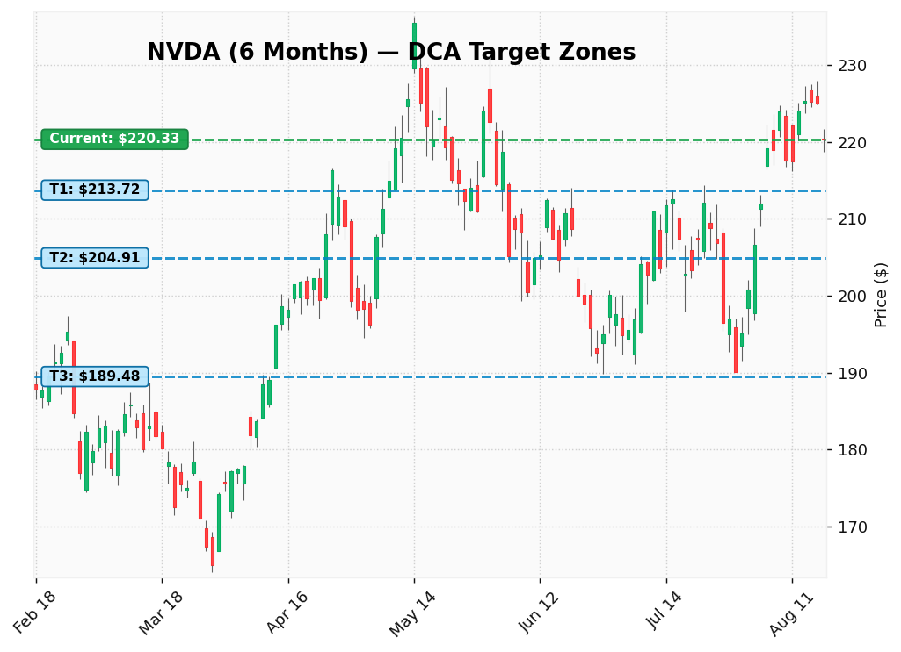
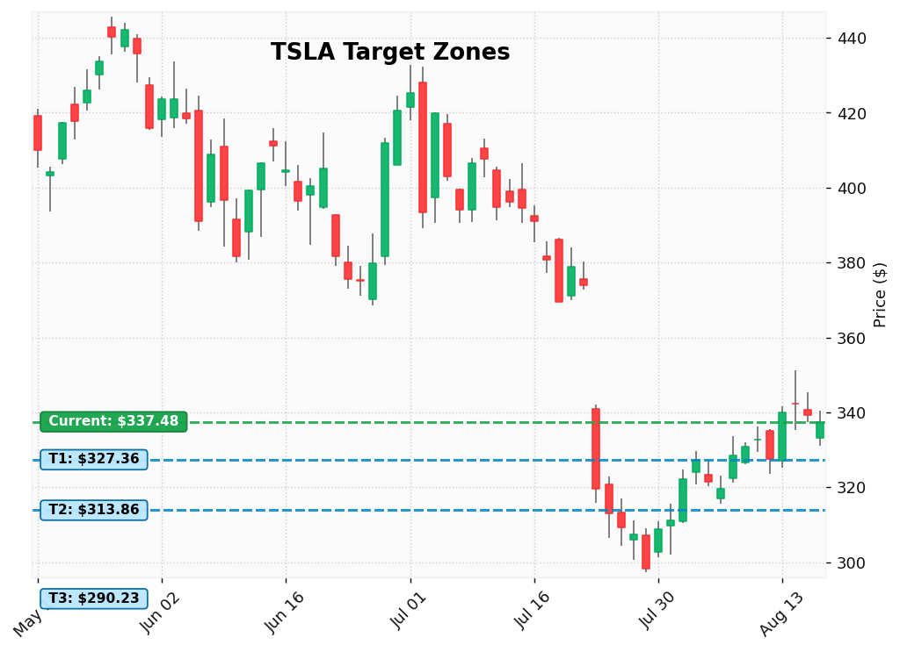

# DCA Catcher 📈

**DCA Catcher** คือระบบ Telegram Bot สำหรับช่วยวิเคราะห์หุ้นและแจ้งเตือนราคาเป้าหมายสำหรับการลงทุนแบบ DCA (Dollar-Cost Averaging) รองรับหุ้นสหรัฐฯ (US) และหุ้นไทย (TH) ทำงานร่วมกับข้อมูลตลาดจริง ข่าวสาร ดัชนีอารมณ์ตลาด และระบบเฝ้าราคาแบบเรียลไทม์

---

## ⚙️ ภาพรวมการทำงานของระบบ (System Overview)

ระบบแบ่งออกเป็น 4 ส่วนหลัก:

```
┌─────────────────┐     ┌──────────────────┐     ┌─────────────────────┐
│ 1. Data Ingestion│ ──> │ 2. Analysis & AI │ ──> │ 3. Chart & Delivery │
│ yfinance / News │     │ Indicators / LLM │     │  Telegram & Buttons │
└─────────────────┘     └──────────────────┘     └─────────────────────┘
                               ▲
                               │
┌──────────────────────────────┴───────────────────────────┐
│ 4. Real-time Monitoring & Webhooks (Alpaca / TradingView) │
└──────────────────────────────────────────────────────────┘
```

---

### 1. การสแกนหุ้นรายตัว (`/scan <SYMBOL>`)
*   **การประประมวลผลข้อมูล:** ดึงราคาและงบการเงินพื้นฐานผ่าน `yfinance` พร้อมคำนวณตัวชี้วัดทางเทคนิค (ATH Drawdown, Volume Anomaly, Moving Averages)
*   **การประเมินเป้าหมาย:** ประมวลผลร่วมกับ AI เพื่อสรุปคะแนนและเสนอระดับราคาเป้าหมาย DCA 3 ไม้ตามระดับความเสี่ยง
*   **Visual Analytics (กราฟแท่งเทียน In-Memory):** สร้างภาพกราฟ Candlestick ด้วย `mplfinance` ใน RAM (`io.BytesIO`) พร้อมระบบ **Adaptive Timeframe** ปรับช่วงเวลาย้อนหลังอัตโนมัติเพื่อให้เส้นเป้าหมายพาดทับแนวรับในอดีตจริง
*   **Interactive Confirmation:** ส่งข้อความบทวิเคราะห์ตามด้วยรูปกราฟ พร้อมปุ่ม Checkbox ให้เลือกบันทึกเป้าหมายเข้าสู่ระบบ Sniper ทันที

---

### 2. บทวิเคราะห์เจาะลึกแบบ Multi-Stage Pipeline (`/scan-details`)
ระบบส่งต่อข้อมูลผ่าน Pipeline วิเคราะห์เฉพาะด้านเพื่อความถูกต้องของข้อมูล:
1. **Data Collection:** รวบรวมข่าวย้อนหลัง, ข้อมูลงบการเงิน และดัชนี Fear & Greed
2. **Specialist Evaluation:** วิเคราะห์แยกด้าน (Fundamental, Sentiment & News, Risk Strategy)
3. **Synthesis & Quality Gate:** ตรวจสอบความถูกต้องของข้อมูลและเรียบเรียงเป็นบทความสรุปภาษาไทย

---

### 3. การเฝ้าราคาแบบเรียลไทม์ (`Alpaca WebSocket`)
*   เชื่อมต่อ WebSocket สตรีมราคา IEX ในช่วงเวลาตลาดสหรัฐฯ เปิดทำการ
*   **Anti-Spam Hysteresis:** ตรวจจับเมื่อราคาแตะโซนเป้าหมาย และส่งแจ้งเตือนเพียง 1 ครั้งต่อโซนราคา เพื่อป้องกันการส่งข้อความซ้ำซ้อน

---

### 4. ระบบความจำวิเคราะห์ต่อเนื่อง (`Adaptive AI Memory`)
*   **2+1 Memory Window:** ดึงประวัติย้อนหลัง 2 ก้าว (`T-2`, `T-1`) เพื่อให้ AI เห็นพัฒนาการของหุ้น (Storyline Continuity)
*   **Dynamic Reflection:** จำแนกสถานะสมมติฐานอัตโนมัติ (`CONTINUING`, `INVALIDATED`, `NEW_CATALYST`, `RESOLVED`)
*   **ML Uncertainty Calibration:** คำนวณคะแนนความมั่นใจ (0–100%) ตามมาตรฐานสากล Machine Learning

---

## 📊 ตัวอย่างภาพกราฟที่ระบบสร้างขึ้น (Visual Analytics Preview)

| ตัวอย่างที่ 1: NVIDIA (NVDA) — Adaptive 6M Timeframe | ตัวอย่างที่ 2: Tesla (TSLA) — Target Levels |
|:---:|:---:|
|  |  |
| *ขยายเป็น 6 เดือนอัตโนมัติเพื่อให้เส้นไม้ 3 (T3) พาดทับแนวรับในอดีตจริง* | *แสดงเส้นราคาปัจจุบันและระดับเป้าหมาย 3 ไม้ พร้อมป้ายราคาชัดเจน* |

---

## 📌 คำสั่งการใช้งานบอท (Bot Commands)

| คำสั่ง | การทำงาน |
|---|---|
| `/start` | เริ่มต้นใช้งานและลงทะเบียนผู้ใช้ |
| `/scan <SYMBOL>` | สแกนหุ้นรายตัว พร้อมกราฟและปุ่มเลือกเป้าหมาย |
| `/scan` | สแกนหุ้นทั้งหมดใน Watchlist |
| `/scan-details <SYMBOL>` | สั่งรันบทวิเคราะห์เชิงลึก (Deep Dive Report) |
| `/add <SYMBOL> [PRICE]` | เพิ่มหุ้นและตั้งราคาเป้าหมายเข้า Watchlist |
| `/remove <SYMBOL>` | ลบหุ้นออกจาก Watchlist |
| `/list` | แสดงรายชื่อหุ้นและระดับราคาเป้าหมายที่บันทึกไว้ |
| `/survey` | แบบประเมินโปรไฟล์ความเสี่ยงของผู้ใช้ |
| `/advice` | ขอคำแนะนำจัดพอร์ตตามเป้าหมายและระยะเวลาลงทุน |
| `/help` | แสดงรายการคำสั่งทั้งหมด |

---

## 📁 โครงสร้างโปรเจกต์ (Project Structure)

```
dca-catcher/
├── src/
│   ├── bot.py                # Telegram Bot Handlers, Keyboards & Dispatcher
│   ├── config.py             # จัดการ Environment Variables และการตั้งค่าระบบ
│   ├── models.py             # Domain Models กลาง (TargetZone Single Source of Truth)
│   ├── memory.py             # Adaptive AI Memory (2+1 Window & Multi-tenant Snapshots)
│   ├── database.py           # จัดการฐานข้อมูล SQLite ผ่าน Async SQLAlchemy
│   ├── fetcher.py            # ดึงข้อมูลตลาดและงบการเงินผ่าน yfinance
│   ├── transform.py          # คำนวณ Technical Indicators และ Volume Anomaly
│   ├── grader.py             # ประเมินคะแนนความน่าลงทุนและคำนวณเป้าหมายเบื้องต้น
│   ├── insight_pipeline.py   # Multi-Agent Pipeline (Specialists, Composer, Quality Gate)
│   ├── charting.py           # สร้างกราฟ Candlestick และ Target Lines (In-Memory)
│   ├── sniper.py             # Alpaca WebSocket สตรีมราคาเรียลไทม์
│   ├── alert_manager.py      # จัดรูปแบบข้อความแจ้งเตือนและระบบ Anti-Spam
│   └── scrapers/
│       └── sentiment.py      # ดึงข่าว Google News RSS และดัชนี Fear & Greed
├── docs/
│   ├── archived_webhook_system.md # เอกสารสถาปัตยกรรม Webhook ที่บันทึกไว้
│   ├── superpowers/specs/    # เอกสารการออกแบบสถาปัตยกรรมระบบ (Design Specs)
│   └── research/             # เอกสารวิจัยและฐานความรู้สากล (Research Foundations)
├── assets/                   # รูปภาพตัวอย่างและ Assets ของโปรเจกต์
├── tests/                    # ชุดทดสอบ Unit & Integration Tests (48 รายการ ผ่าน 100%)
├── requirements.txt          # รายการ Python Dependencies
├── Dockerfile                # ไฟล์สำหรับ Build Docker Container
└── docker-compose.yml        # คอนฟิกสำหรับรันระบบบน Docker
```

---

## 🚀 การติดตั้งและรันระบบ (Setup & Running)

### 1. ติดตั้ง Dependencies
```bash
python -m venv venv
source venv/bin/activate
pip install -r requirements.txt
```

### 2. ตั้งค่าไฟล์สภาพแวดล้อม (`.env`)
คัดลอกไฟล์เทมเพลตและระบุค่าคอนฟิกที่จำเป็น:
```bash
cp .env.example .env
```
*(ดูคำอธิบายและรายละเอียดของแต่ละ Parameter ได้ภายในไฟล์ [`.env.example`](file:///.env.example))*

### 3. รันการทดสอบ (Run Tests)
```bash
venv/bin/pytest
```

### 4. เริ่มต้นการทำงานของบอท (Run Bot)
```bash
set -a && source .env && set +a && PYTHONPATH=. venv/bin/python -m src.bot
```

หรือรันผ่าน Docker:
```bash
docker-compose up -d --build
```

---

## ☁️ การทดลองใช้งานระบบคลาวด์ 24/7 (Cloud Hosting Exploration)

ณ ปัจจุบัน โปรเจกต์กำลังอยู่ในช่วงการทดสอบและเปรียบเทียบการ Deploy บอทบนคลาวด์ 2 แพลตฟอร์มหลัก เพื่อประเมินความเสถียรของเครือข่าย ความคุ้มค่า และความเหมาะสมในการรันงานเฝ้าตลาดหุ้นแบบเรียลไทม์ (24/7 Always-On Worker):

1. **Oracle Cloud Infrastructure (Always Free Tier):**
   * **จุดเด่น:** สเปกเครื่องสูง (ARM 4 Cores + 24 GB RAM) เหมาะสำหรับรันทั้ง Bot และ Local Database ในเครื่องเดียว
   * **สถานะการทดสอบ:** ศึกษาการตั้งค่า VCN, Security Lists, และวิเคราะห์ข้อจำกัด Host Capacity ในภูมิภาคต่างๆ
2. **Fly.io (Region Singapore):**
   * **จุดเด่น:** ใช้งานง่ายผ่าน `Dockerfile` และ `fly.toml` Latency ต่ำใกล้ประเทศไทย และรองรับระบบ Always-On Worker
   * **สถานะการทดสอบ:** ทำการ Deploy บอทจริงในโหมด Background Worker และทดสอบการเชื่อมต่อ WebSocket ต่อเนื่อง 24 ชม.

---

## 🔮 แผนงานและการวิจัยที่กำลังพัฒนา (Phase 7: Real-Time Catalyst & Supply Chain Hunter)

ปัจจุบันระบบกำลังต่อยอดความสามารถสู่การตรวจจับข่าวสารเชิงรุก (Proactive Catalyst Detection) โดยอ้างอิงหลักการจากงานวิจัยด้าน Financial NLP และเศรษฐศาสตร์การเงิน:

*   **การตรวจจับข่าวสารสำคัญล่วงหน้า (Pre-Market Catalyst Detection):** 
    * อ้างอิงงานวิจัยด้านผลกระทบของพาดหัวข่าวต่อการเคลื่อนไหวของราคา (University of Florida, EMNLP) 
    * ระบบจะดักฟังข่าวสารทางการ (Press Releases, SEC Filings) ในช่วง Pre-Market (17:00–19:30 น. เวลาไทย) เพื่อสรุปสาระสำคัญให้ผู้ใช้เตรียมตัวล่วงหน้าก่อนตลาดเปิด
*   **การประเมิน 2 ด้านอย่างเป็นกลาง (Dual-Perspective Evaluation):**
    * นำเสนอทั้งโอกาสเติบโตทางธุรกิจ (Bullish Factors) ควบคู่กับความเสี่ยงและจุดที่ต้องระวัง (Bearish Risks) เพื่อป้องกันการไล่ซื้อราคาเปิดกระโดด
*   **การวิเคราะห์ผลกระทบเชื่อมโยงในห่วงโซ่อุปทาน (Supply Chain & Spillover Analysis):**
    * อ้างอิงงานวิจัยด้าน Economic Links & Investor Inattention (Journal of Finance) 
    * เมื่อเกิดเหตุการณ์สำคัญกับบริษัทหลัก ระบบจะประเมินผลกระทบทางอ้อมไปยังบริษัทคู่ค้า ซัพพลายเออร์ หรือกลุ่มอุตสาหกรรมเดียวกันที่อาจได้รับอานิสงส์ตามมา
*   **การจัดการระบบอย่างมีประสิทธิภาพ (Layered Processing):**
    * ใช้การคัดกรองข้อมูลแบบหลายชั้น (Multi-tier Filtering) และจำแนกความสำคัญของข่าวสาร เพื่อให้ระบบทำงานได้รวดเร็ว ประหยัดทรัพยากรเซิร์ฟเวอร์ และส่งเฉพาะการแจ้งเตือนที่มีคุณภาพ ไม่รบกวนผู้ใช้
