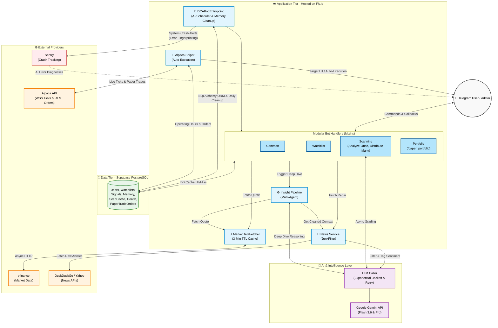

# DCA Catcher 📈 (Phase 14: Token & Architecture Optimizations)

**DCA Catcher** คือระบบ Telegram Bot สำหรับช่วยวิเคราะห์หุ้นและแจ้งเตือนราคาเป้าหมายสำหรับการลงทุนแบบ DCA (Dollar-Cost Averaging) 

---


## 🚀 What's New in Phase 14 (Token & Architecture Optimizations)

Phase 14 ยกระดับสถาปัตยกรรมของระบบให้เสถียรและประหยัดทรัพยากรมากที่สุดบนสภาพแวดล้อม Cloud ฟรี:

1. **Architecture Resiliency (Critical Fixes):**
   - **Event Loop Unblocking:** ย้ายการประมวลผล LLM ทั้งหมด (เช่น `grader.grade()`) ไปรันบน `asyncio.to_thread()` ทำให้บอทไม่ค้างระหว่าง Broadcast หรือสร้างรายงาน Pre-market
   - **Scheduler Graceful Shutdown:** ระบบเคลียร์ cron jobs ของ `APScheduler` สะอาดหมดจดเมื่อปิดบอท ป้องกันปัญหา Zombie Process บน Fly.io
   - **Error Fingerprinting & LLM Backoff:** เพิ่มระบบคัดกรอง Error ป้องกันการส่ง AI วิเคราะห์ Error ซ้ำซ้อน (ลด Spam) และเพิ่ม Exponential Backoff จัดการปัญหา Gemini Rate Limit (429) แบบนุ่มนวล
   - **Memory Leak Prevention:** เพิ่ม Daily Cleanup สำหรับล้าง TTL Dictionary (เช่น Cooldowns) คืนหน่วยความจำให้ระบบ
2. **Token & Performance Optimizations (ประหยัด ~11,500+ Tokens/วัน):**
   - **Analyze Once, Distribute Many:** เปลี่ยนวิธีการทำงานของ `/premarket` และ `broadcast` เป็นการวิเคราะห์ผล 1 ครั้งแล้วดึงจาก Cache มากระจายให้ทุกคนแทนที่จะให้ AI วิเคราะห์ซ้ำ
   - **Cross-Command DB Caching:** ระบบสามารถอ่านค่า Cache ข้ามฟีเจอร์ได้สมบูรณ์ (ลด 1 AI call = 6,000 tokens/day)
   - **Compact JSON Formats:** บีบอัด Payload สื่อสารระหว่าง Multi-Agent Pipeline ลดช่องว่าง Token สิ้นเปลืองได้ ~1,500 tokens/day
   - **Fetcher Memory Cache (3 mins TTL):** ลดการชน API yfinance ลดเวลาโหลดซ้ำ 3-5 วินาทีต่อครั้ง
3. **Database Maintenance:** สั่งล้างข้อมูล Cache เก่าออกจากฐานข้อมูล Supabase อัตโนมัติทุกเช้า ป้องกันปัญหาตารางบวม (DB Bloat)

---


## 📜 Development History (ประวัติการพัฒนา)

ระบบถูกพัฒนาและยกระดับอย่างต่อเนื่องผ่าน 10 เฟสหลัก ดังนี้:

- **Phase 1-5 (Core Foundation):** สร้างระบบดึงข้อมูลจาก `yfinance`, คำนวณ DCA Targets ด้วย AI, วาดกราฟแท่งเทียน, และใช้ฐานข้อมูล SQLite
- **Phase 6 (Multi-Agent & Memory):** อัปเกรด AI เป็น Multi-Agent Pipeline (แบ่งหน้าที่วิเคราะห์กราฟ, ข่าว, งบการเงิน) และเพิ่ม Adaptive Memory ให้บอทจำพอร์ตผู้ใช้ได้
- **Phase 7 (Catalyst Hunter):** เปลี่ยนสถาปัตยกรรมสู่ Cloud (Fly.io + Supabase PostgreSQL) เพื่อรองรับดึงข้อมูลคู่ขนาน พร้อมเพิ่มบอทดักจับข่าวด่วน Pre-Market (Tier S/A/B)
- **Phase 8 (Slip & Portfolio):** เพิ่มระบบ AI อ่านสลิปโอนเงิน (Slip Parser) เพื่อบันทึกต้นทุน DCA ในพอร์ตแบบอัตโนมัติ 
- **Phase 9 (System Hardening):** ย้ายการทำงานกราฟไปเป็นแบบ `asyncio.to_thread()` ป้องกันบอทค้าง, เพิ่ม Cooldown กันสแปม, จัดการ Rate Limit ของ Telegram
- **Phase 10 (News Engine & Modular):**
  - **Multi-Source News:** เพิ่ม `DuckDuckGo News` เป็นระบบสำรองเพื่อป้องกัน Error 429 จาก Yahoo
  - **Modular Architecture:** รื้อระบบ `bot.py` (1,600+ บรรทัด) ออกเป็น 5 Router/Mixins (Common, Watchlist, Scanning, Portfolio, Survey) เพื่อความสะอาดของโค้ด
- **Phase 11 (Stability & Observability):**
  - **Global Response Caching:** สร้างระบบจดจำผลลัพธ์ของ `/scan` และ `/news` ด้วยตาราง `scan_cache` บน Supabase (ลด API Quota 100% หากดึงข้อมูลซ้ำภายใน 1-2 ชม. พร้อมฟื้นฟู Interactive Buttons & Charts สมบูรณ์)
  - **Sentry & AI Error Analysis:** ติดตั้ง `sentry-sdk` ดักจับ System Crash ทุกจุด พร้อมระบบวิเคราะห์ Error ด้วย **Gemini AI** เพื่อแจ้งเตือน Telegram Admin โดยตรงด้วยคำอธิบายภาษาไทยและวิธีแก้ปัญหา
  - **Test Suite Repair:** ซ่อมแซมและอัปเดตระบบ Mock Tests ครอบคลุม Mixins ทั้งหมด (91 Tests Passed)
- **Phase 12 (Pre-Market Calendar & Health Tracker):**
  - **Pre-Market Daily Digest:** ตั้งเวลา `APScheduler` ส่งสรุปข่าวพร้อมราคาหุ้นแบบ DM ล่วงหน้า 1 ชม. ก่อนตลาด US เปิด (19:30 น.) เฉพาะหุ้นใน Watchlist ของผู้ใช้แต่ละคน
  - **Fundamental Health Tracker:** ดึงและบันทึกข้อมูลด้านงบการเงิน (P/E, EPS, Profit Margin, Revenue Growth) ลงฐานข้อมูลทุกวันเพื่อใช้ประเมินเทรนด์การเติบโต
- **Phase 13 (Alpaca Paper Trading):**
  - **Auto-Execution Sniper:** อัปเกรด Sniper Alert ให้สามารถยิงออเดอร์จำลอง (Paper Trade) ซื้อหุ้นอัตโนมัติผ่าน `Alpaca API` เมื่อราคาชนโซนแนวรับที่ตั้งไว้ (Fail-safe architecture ไม่กระทบระบบแจ้งเตือนหลัก)
  - **Paper Portfolio Tracker:** เพิ่มคำสั่ง `/paper_portfolio` เช็คประวัติการยิงออเดอร์และสรุปกำไร/ขาดทุน (P/L) จากการเทรดจำลองแบบ Real-time
- **Phase 14 (Architecture Resiliency & Token Optimization):**
  - **Analyze Once, Distribute Many:** ปรับโครงสร้าง /premarket และ broadcast ให้อ่านจาก Cache ข้ามคำสั่ง เพื่อลดการคำนวณซ้ำซ้อน ประหยัด 11,500+ tokens/day
  - **Event Loop & Memory Leak Fixes:** ห่อ synchronous AI calls ด้วย `asyncio.to_thread()`, ล้าง TTL memory อัตโนมัติ, และเพิ่ม Exponential Backoff ป้องกัน 429 cascade

---


## ⚙️ ภาพรวมการทำงานของระบบ (System Overview - Phase 14)

ระบบออกแบบโครงสร้างใหม่โดยยึดหลัก Clean Architecture และ Free-Tier Optimization:



---

### 1. การสแกนหุ้นรายตัว (`/scan <SYMBOL>`)
*   **การประประมวลผลข้อมูล:** ดึงราคาและงบการเงินพื้นฐานผ่าน `yfinance` พร้อมคำนวณตัวชี้วัดทางเทคนิค
*   **การประเมินเป้าหมาย:** ประมวลผลร่วมกับ AI เพื่อสรุปคะแนนและเสนอระดับราคาเป้าหมาย DCA 3 ไม้
*   **Visual Analytics:** สร้างภาพกราฟ Candlestick ใน RAM พร้อมระบบ **Adaptive Timeframe** 

### 2. บทวิเคราะห์เจาะลึกแบบ Multi-Stage Pipeline (`/scan-details`)
ระบบส่งต่อข้อมูลผ่าน Pipeline วิเคราะห์เฉพาะด้านเพื่อความถูกต้องของข้อมูล:
1. **Data Collection:** รวบรวมข่าวย้อนหลัง, ข้อมูลงบการเงิน และดัชนี Fear & Greed
2. **Specialist Evaluation:** วิเคราะห์แยกด้าน (Fundamental, Sentiment & News, Risk Strategy)
3. **Synthesis & Quality Gate:** ตรวจสอบความถูกต้องและสรุปเป็นภาษาไทย

### 3. การเฝ้าราคาแบบเรียลไทม์ (`Alpaca WebSocket`)
*   เชื่อมต่อ WebSocket สตรีมราคา IEX ในช่วงเวลาตลาดสหรัฐฯ เปิดทำการ
*   **Anti-Spam Hysteresis:** ตรวจจับเมื่อราคาแตะโซนเป้าหมาย และส่งแจ้งเตือนเพียง 1 ครั้งต่อโซนราคา

### 4. ระบบความจำวิเคราะห์ต่อเนื่อง (`Adaptive AI Memory`)
*   **2+1 Memory Window:** ดึงประวัติย้อนหลัง 2 ก้าว (`T-2`, `T-1`) เพื่อให้ AI เห็นพัฒนาการของหุ้น
*   **Dynamic Reflection & Calibration:** จำแนกสถานะสมมติฐานและให้คะแนนความมั่นใจ (0-100%)


### 5. ระบบแกะสลิปและบันทึกพอร์ต (Slip-to-Portfolio Tracker)
*   **Vision Extraction:** ส่งรูปสลิปซื้อขายให้บอทอ่านข้อมูล (หุ้น, ราคา, ปริมาณ, BUY/SELL) อัตโนมัติด้วย AI
*   **Portfolio PnL:** คำนวณต้นทุนเฉลี่ยและกำไร/ขาดทุน (PnL) แบบ Real-time เปรียบเทียบกับราคาตลาด (`/portfolio`)

---

## 📊 ตัวอย่างภาพกราฟที่ระบบสร้างขึ้น (Visual Analytics Preview)

| ตัวอย่างที่ 1: NVIDIA (NVDA) — Adaptive 6M Timeframe | ตัวอย่างที่ 2: Tesla (TSLA) — Target Levels |
|:---:|:---:|
|  |  |


---

## 🚀 ประวัติการพัฒนา (Development Roadmap & Phases)

การพัฒนาระบบ DCA Catcher ถูกแบ่งออกเป็น Phase ย่อยๆ เพื่อให้ระบบเติบโตอย่างมีแบบแผนและแก้ไขปัญหา (Pain point) ได้ตรงจุด:

| Phase | หัวข้อ | ฟีเจอร์ที่เพิ่มเข้ามา | ประโยชน์และการแก้ปัญหา |
|---|---|---|---|
| **Phase 1-2** | **Core Foundation** | ระบบสแกนหุ้นรายตัว (`/scan`), เชื่อมต่อ yfinance, ให้คะแนนเทคนิคด้วย Gemini | **ระบบพื้นฐาน:** ช่วยให้ผู้ใช้ดึงราคาและวิเคราะห์กราฟ (RSI, MA) เบื้องต้นได้ทันทีโดยไม่ต้องเปิดแอปเทรด |
| **Phase 3** | **Database & Risk** | เปลี่ยนเป็น PostgreSQL, เพิ่มระบบ Multi-user และแบบประเมินความเสี่ยง (`/survey`) | **การรองรับผู้ใช้:** แก้ปัญหาฐานข้อมูลล็อก (DB is locked) และทำให้ AI แนะนำเป้าหมายได้ตรงกับนิสัยความเสี่ยงของแต่ละบุคคล |
| **Phase 4** | **Real-time Sniper** | ระบบ WebSocket เชื่อมต่อตลาดสดผ่าน Alpaca API, แจ้งเตือนเมื่อราคาชนเป้า (Target Alerts) | **ความเร็ว:** แก้ปัญหาผู้ใช้พลาดจุดซื้อสำคัญ โดยบอทจะเฝ้าราคาแบบเรียลไทม์ และกันการแจ้งเตือนสแปมด้วย Hysteresis |
| **Phase 5** | **Insight Pipeline** | บทวิเคราะห์เจาะลึก (`/scan-details`) ทำงานแบบ Multi-Agent (ทีม AI แยกเฉพาะทาง) | **ความลึกของข้อมูล:** แก้ปัญหา AI ตัวเดียวให้ข้อมูลมั่ว โดยแบ่งเป็น Specialist อ่านงบการเงิน, ข่าว, และประเมินความเสี่ยงแยกกัน |
| **Phase 6** | **Visual Analytics** | ระบบสร้างภาพกราฟ (Charting) พร้อมระบบ Adaptive Timeframe | **UX/UI:** ช่วยให้ผู้ใช้เห็นภาพรวมราคา (Drawdown) และเป้าหมายที่ AI เสนอได้ทันทีบนกราฟ เข้าใจง่ายใน 3 วินาที |
| **Phase 7** | **Catalyst & Memory** | ระบบ Background สแกนข่าวแบบอัตโนมัติ และระบบความจำ AI (`Adaptive Memory`) | **ความต่อเนื่อง:** แก้ปัญหา AI ความจำสั้น โดยบอทจะจำสถานะหุ้นย้อนหลัง 2 ก้าว และตื่นมารายงานข่าว (Daily Digest) ให้เอง |
| **Phase 8** | **Slip-to-Portfolio** | แกะข้อมูลสลิปด้วย Vision AI, บันทึกพอร์ต, คำนวณ PnL แบบ Real-time (`/portfolio`) | **ความสะดวก:** แก้ปัญหาขี้เกียจคีย์ข้อมูลพอร์ต เพียงแค่โยนรูปสลิป บอทจะแกะเลขและติดตามกำไร/ขาดทุนให้เป๊ะๆ |

---

## 📌 คำสั่งการใช้งานบอท (Bot Commands)

| คำสั่ง | การทำงาน |
|---|---|
| `/start` | เริ่มต้นใช้งานและลงทะเบียนผู้ใช้ |
| `/scan <SYMBOL>` | สแกนหุ้นรายตัว พร้อมกราฟและปุ่มเลือกเป้าหมาย |
| `/scan` | สแกนหุ้นทั้งหมดใน Watchlist |
| `/scan-details <SYMBOL>` | สั่งรันบทวิเคราะห์เชิงลึก (Deep Dive Report) |
| `/add <SYMBOL> [PRICE]` | เพิ่มหุ้นและตั้งราคาเป้าหมายเข้า Watchlist |
| `/remove <SYMBOL>` | ลบหุ้นออกจาก Watchlist |
| `/list` | แสดงรายชื่อหุ้นและระดับราคาเป้าหมาย |
| `/portfolio` | แสดงสรุปพอร์ต DCA พร้อม P/L แบบเรียลไทม์ |
| `/survey` | แบบประเมินโปรไฟล์ความเสี่ยง |
| `/help` | แสดงรายการคำสั่งทั้งหมด |

---

## 📁 โครงสร้างโปรเจกต์ (Project Structure)

```
dca-catcher/
├── src/
│   ├── bot.py                # Telegram Bot Handlers
│   ├── config.py             # Environment Variables
│   ├── models.py             # Domain Models (TargetZone)
│   ├── memory.py             # Adaptive AI Memory
│   ├── database.py           # Database Manager (PostgreSQL/SQLite)
│   ├── fetcher.py            # Market Data (yfinance)
│   ├── transform.py          # Technical Indicators
│   ├── grader.py             # AI Evaluation & Target Pricing
│   ├── insight_pipeline.py   # Multi-Agent Pipeline
│   ├── charting.py           # Candlestick Generation
│   ├── sniper.py             # Alpaca WebSocket
│   ├── alert_manager.py      # Notification Formatting
│   ├── catalyst/             # 🛰️ Phase 7: Real-Time Market Catalyst
│   │   ├── models.py
│   │   ├── evaluator.py
│   │   ├── hunter.py
│   │   ├── providers/
│   │   └── verifiers/
│   └── scrapers/
│       └── sentiment.py
├── docs/                     # Architecture & Research Docs
├── assets/                   # Images & Assets
├── tests/                    # Pytest Suite (69 passing)
├── requirements.txt
├── Dockerfile
└── docker-compose.yml
```

---

## ☁️ สถาปัตยกรรมคลาวด์ระดับ Production (Stateless Architecture)

ปัจจุบันระบบถูกยกระดับเป็น **Stateless Architecture** เพื่อความเสถียร 100%:
1. **Compute Layer (Fly.io):** รันโค้ด Python, Telegram Bot, และ Scheduler
2. **Database Layer (Supabase PostgreSQL):** จัดเก็บข้อมูลทั้งหมด (Users, Watchlists, Memory) พร้อมรองรับ Connection Pooling (`asyncpg`) อัจฉริยะ ทำให้ระบบสามารถรันขนานกันได้โดยไม่เจอข้อจำกัด `Database is locked`

*(หมายเหตุ: โค้ดยังคงรองรับ SQLite สำหรับการรันทดสอบบนเครื่อง Local เพียงเปลี่ยน `DATABASE_URL`)*
