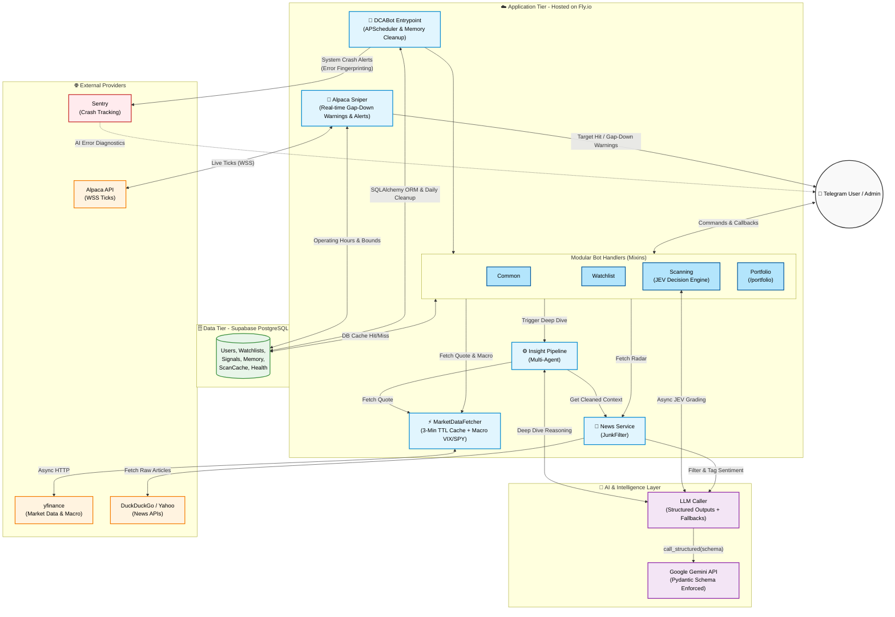

# DCA Catcher 📈 (Phase 17: JEV Engine & Structured Outputs)

**DCA Catcher** คือระบบ Telegram Bot สำหรับช่วยวิเคราะห์หุ้นและแจ้งเตือนราคาเป้าหมายสำหรับการลงทุนแบบ DCA (Dollar-Cost Averaging) 

## 💡 Concept & Vision (แนวคิดภาพรวมของระบบ)

ตลาดหุ้นในปัจจุบันมีความผันผวนสูงและข้อมูลมหาศาล **DCA Catcher** ถูกออกแบบมาเพื่อตอบโจทย์นักลงทุนสายถือยาว (DCA / Value Investor) ที่ต้องการ **"สะสมหุ้นคุณภาพดี ในราคาที่เหมาะสม"** แต่ไม่มีเวลาเฝ้าหน้าจอหรือวิเคราะห์งบการเงินทุกวัน

ระบบนี้ไม่ได้เป็นแค่บอทแจ้งเตือนราคา แต่ทำหน้าที่เป็น **"ทีมวิเคราะห์ Quant ส่วนตัว"** ที่ผสานพลังของข้อมูลสถิติ (Data) เข้ากับปัญญาประดิษฐ์ (Generative AI) เพื่อประเมินสุขภาพหุ้น หาจุดเข้าซื้อที่ปลอดภัยที่สุด และคอยเฝ้าราคาให้คุณตลอด 24 ชั่วโมงผ่าน Telegram

---

## 🧠 Core Systems (หัวใจหลักของการทำงาน 4 โมดูล)

1. **🤖 AI Quant Evaluator (สมองวิเคราะห์เชิงปริมาณ):** ประเมิน Fundamental & Technical ผ่าน Gemini 1.5 หาเป้าหมายสะสมที่ปลอดภัย
2. **🎯 Real-Time Price Sniper (พลซุ่มยิงเฝ้าราคา):** เชื่อมต่อสัญญาณสด Alpaca WebSocket แจ้งเตือนเมื่อราคาชนเป้าหมาย
3. **📰 Multi-Agent & Catalyst Radar (ทีมวิจัยและเรดาร์ข่าว):** วิเคราะห์ข่าวเชิงลึกแบบอัตโนมัติด้วย AI แยกเฉพาะทาง (Insight Pipeline)
4. **📸 Vision AI Portfolio (บันทึกพอร์ตผ่านสลิป):** อ่านรูปสลิปเทรดหุ้นและอัปเดตพอร์ตให้อัตโนมัติ พร้อมสรุปกำไรขาดทุน

---

## 🚀 What's New in Phase 17 (JEV Engine & Structured Outputs)

Phase 17 ยกระดับความเสถียรของระบบด้วยสถาปัตยกรรม **"JEV Decision Engine"** แบบ 100% Guaranteed JSON:

1. **Engine-Level Schema Enforcement:**
   - เปลี่ยนจาก Prompt Engineering (Free-text) ไปใช้ **Gemini Structured Outputs (`response_schema`)** ผ่าน Pydantic Models
   - การันตีโครงสร้าง JSON 100% ตัดปัญหา `JSONDecodeError` ถาวร 
2. **Token & Performance Optimization:**
   - ถอดคำสั่งบังคับ JSON Schema ออกจาก Prompt ประหยัดไปได้ ~150 Tokens/Request
   - มีระบบ Fallback 2 ชั้น (Structured Output → Legacy Regex Parse) เพื่อความทนทานของระบบ
3. **Macro-to-Micro Pipeline:**
   - เพิ่มการดึงข้อมูล `^VIX` และ `SPY` มาร่วมเป็น Context ตัดสินใจของ AI (Macro Adjustment)
   - ปรับแนวรับและเป้าหมายเข้าซื้อแบบไดนามิกอิงตามระดับความผันผวนของตลาด

---

## 📜 Development History (ประวัติการพัฒนา)

ระบบถูกพัฒนาและยกระดับอย่างต่อเนื่องผ่านเฟสหลัก ดังนี้:

- **Phase 1-5 (Core Foundation):** ระบบดึงข้อมูลจาก `yfinance`, คำนวณเป้าหมายด้วย AI, วาดกราฟแท่งเทียน, และใช้ฐานข้อมูล SQLite
- **Phase 6-10 (Multi-Agent & Scale):** อัปเกรด AI เป็นทีมวิเคราะห์ (Insight Pipeline), เปลี่ยนฐานข้อมูลเป็น PostgreSQL บน Fly.io, ระบบอ่านสลิป (Vision AI), และจัดการ Telegram Rate Limits
- **Phase 11-13 (Observability & Trading):** ระบบ Cache ลด API Quota, ต่อ Sentry ดักจับ Error ด้วย AI, ปฏิทิน Pre-Market สรุปข่าวรายวัน, และ Paper Trading พอร์ตจำลอง
- **Phase 14 (Resiliency & Tuning):** ทำ Analyze Once / Distribute Many (ประหยัด Token หมื่นกว่า/วัน), แก้ไข Memory Leaks และ unblocking event loop
- **Phase 15 (Dead Code Audit & Cleanups):** เคลียร์โค้ดขยะ, ตรวจสอบ Code Quality ของโมดูล Core ทั้งหมด
- **Phase 16 (Macro Context & Sniper Warn):** รับข้อมูล Macro (VIX/SPY) เข้ามาใช้ในการให้คะแนนหุ้น, แจ้งเตือน 🚨 GAP-DOWN พิเศษหากหุ้นตกอย่างรุนแรง
- **Phase 17 (JEV Engine & Structured Outputs):** ใช้ Pydantic บังคับ JSON ออกจากระดับ Engine (100% Reliability) พร้อมลด Token ใช้งานขาเข้า

---

## ⚙️ ภาพรวมการทำงานของระบบ (System Overview - Phase 17)

ระบบออกแบบโครงสร้างใหม่โดยยึดหลัก Clean Architecture และ JEV Decision Engine:



---

### 1. การสแกนหุ้นรายตัว (`/scan <SYMBOL>`)
*   **การประประมวลผลข้อมูล:** ดึงราคาและงบการเงินพื้นฐานผ่าน `yfinance` พร้อมคำนวณตัวชี้วัดทางเทคนิค
*   **การประเมินเป้าหมาย:** ประมวลผลร่วมกับ AI เพื่อสรุปคะแนนและเสนอระดับราคาเป้าหมาย DCA 3 ไม้
*   **Visual Analytics:** สร้างภาพกราฟ Candlestick ใน RAM พร้อมระบบ **Adaptive Timeframe** 

### 2. บทวิเคราะห์เจาะลึกแบบ Multi-Stage Pipeline (`/scan-details`)
ระบบส่งต่อข้อมูลผ่าน Pipeline วิเคราะห์เฉพาะด้านเพื่อความถูกต้องของข้อมูล:
1. **Data Collection:** รวบรวมข่าวย้อนหลัง, ข้อมูลงบการเงิน และดัชนี Fear & Greed
2. **Specialist Evaluation:** วิเคราะห์แยกด้าน (Fundamental, Sentiment & News, Risk Strategy)
3. **Synthesis & Quality Gate:** ตรวจสอบความถูกต้องและสรุปเป็นภาษาไทย

### 3. การเฝ้าราคาแบบเรียลไทม์ (`Alpaca WebSocket`)
*   เชื่อมต่อ WebSocket สตรีมราคา IEX ในช่วงเวลาตลาดสหรัฐฯ เปิดทำการ
*   **Anti-Spam Hysteresis:** ตรวจจับเมื่อราคาแตะโซนเป้าหมาย และส่งแจ้งเตือนเพียง 1 ครั้งต่อโซนราคา

### 4. ระบบความจำวิเคราะห์ต่อเนื่อง (`Adaptive AI Memory`)
*   **2+1 Memory Window:** ดึงประวัติย้อนหลัง 2 ก้าว (`T-2`, `T-1`) เพื่อให้ AI เห็นพัฒนาการของหุ้น
*   **Dynamic Reflection & Calibration:** จำแนกสถานะสมมติฐานและให้คะแนนความมั่นใจ (0-100%)


### 5. ระบบแกะสลิปและบันทึกพอร์ต (Slip-to-Portfolio Tracker)
*   **Vision Extraction:** ส่งรูปสลิปซื้อขายให้บอทอ่านข้อมูล (หุ้น, ราคา, ปริมาณ, BUY/SELL) อัตโนมัติด้วย AI
*   **Portfolio PnL:** คำนวณต้นทุนเฉลี่ยและกำไร/ขาดทุน (PnL) แบบ Real-time เปรียบเทียบกับราคาตลาด (`/portfolio`)

---

## 📊 ตัวอย่างภาพกราฟที่ระบบสร้างขึ้น (Visual Analytics Preview)

| ตัวอย่างที่ 1: NVIDIA (NVDA) — Adaptive 6M Timeframe | ตัวอย่างที่ 2: Tesla (TSLA) — Target Levels |
|:---:|:---:|
|  |  |


---

## 🚀 ประวัติการพัฒนา (Development Roadmap & Phases)

การพัฒนาระบบ DCA Catcher ถูกแบ่งออกเป็น Phase ย่อยๆ เพื่อให้ระบบเติบโตอย่างมีแบบแผนและแก้ไขปัญหา (Pain point) ได้ตรงจุด:

| Phase | หัวข้อ | ฟีเจอร์ที่เพิ่มเข้ามา | ประโยชน์และการแก้ปัญหา |
|---|---|---|---|
| **Phase 1-2** | **Core Foundation** | ระบบสแกนหุ้นรายตัว (`/scan`), เชื่อมต่อ yfinance, ให้คะแนนเทคนิคด้วย Gemini | **ระบบพื้นฐาน:** ช่วยให้ผู้ใช้ดึงราคาและวิเคราะห์กราฟ (RSI, MA) เบื้องต้นได้ทันทีโดยไม่ต้องเปิดแอปเทรด |
| **Phase 3** | **Database & Risk** | เปลี่ยนเป็น PostgreSQL, เพิ่มระบบ Multi-user และแบบประเมินความเสี่ยง (`/survey`) | **การรองรับผู้ใช้:** แก้ปัญหาฐานข้อมูลล็อก (DB is locked) และทำให้ AI แนะนำเป้าหมายได้ตรงกับนิสัยความเสี่ยงของแต่ละบุคคล |
| **Phase 4** | **Real-time Sniper** | ระบบ WebSocket เชื่อมต่อตลาดสดผ่าน Alpaca API, แจ้งเตือนเมื่อราคาชนเป้า (Target Alerts) | **ความเร็ว:** แก้ปัญหาผู้ใช้พลาดจุดซื้อสำคัญ โดยบอทจะเฝ้าราคาแบบเรียลไทม์ และกันการแจ้งเตือนสแปมด้วย Hysteresis |
| **Phase 5** | **Insight Pipeline** | บทวิเคราะห์เจาะลึก (`/scan-details`) ทำงานแบบ Multi-Agent (ทีม AI แยกเฉพาะทาง) | **ความลึกของข้อมูล:** แก้ปัญหา AI ตัวเดียวให้ข้อมูลมั่ว โดยแบ่งเป็น Specialist อ่านงบการเงิน, ข่าว, และประเมินความเสี่ยงแยกกัน |
| **Phase 6** | **Visual Analytics** | ระบบสร้างภาพกราฟ (Charting) พร้อมระบบ Adaptive Timeframe | **UX/UI:** ช่วยให้ผู้ใช้เห็นภาพรวมราคา (Drawdown) และเป้าหมายที่ AI เสนอได้ทันทีบนกราฟ เข้าใจง่ายใน 3 วินาที |
| **Phase 7** | **Catalyst & Memory** | ระบบ Background สแกนข่าวแบบอัตโนมัติ และระบบความจำ AI (`Adaptive Memory`) | **ความต่อเนื่อง:** แก้ปัญหา AI ความจำสั้น โดยบอทจะจำสถานะหุ้นย้อนหลัง 2 ก้าว และตื่นมารายงานข่าว (Daily Digest) ให้เอง |
| **Phase 8** | **Slip-to-Portfolio** | แกะข้อมูลสลิปด้วย Vision AI, บันทึกพอร์ต, คำนวณ PnL แบบ Real-time (`/portfolio`) | **ความสะดวก:** แก้ปัญหาขี้เกียจคีย์ข้อมูลพอร์ต เพียงแค่โยนรูปสลิป บอทจะแกะเลขและติดตามกำไร/ขาดทุนให้เป๊ะๆ |

---

## 📌 คำสั่งการใช้งานบอท (Bot Commands)

| คำสั่ง | การทำงาน |
|---|---|
| `/start` | เริ่มต้นใช้งานและลงทะเบียนผู้ใช้ |
| `/scan <SYMBOL>` | สแกนหุ้นรายตัว พร้อมกราฟและปุ่มเลือกเป้าหมาย |
| `/scan` | สแกนหุ้นทั้งหมดใน Watchlist |
| `/scan-details <SYMBOL>` | สั่งรันบทวิเคราะห์เชิงลึก (Deep Dive Report) |
| `/add <SYMBOL> [PRICE]` | เพิ่มหุ้นและตั้งราคาเป้าหมายเข้า Watchlist |
| `/remove <SYMBOL>` | ลบหุ้นออกจาก Watchlist |
| `/list` | แสดงรายชื่อหุ้นและระดับราคาเป้าหมาย |
| `/portfolio` | แสดงสรุปพอร์ต DCA พร้อม P/L แบบเรียลไทม์ |
| `/survey` | แบบประเมินโปรไฟล์ความเสี่ยง |
| `/help` | แสดงรายการคำสั่งทั้งหมด |

---

## 📁 โครงสร้างโปรเจกต์ (Project Structure)

```
dca-catcher/
├── src/
│   ├── bot.py                # Telegram Bot Handlers
│   ├── config.py             # Environment Variables
│   ├── models.py             # Domain Models (TargetZone)
│   ├── memory.py             # Adaptive AI Memory
│   ├── database.py           # Database Manager (PostgreSQL/SQLite)
│   ├── fetcher.py            # Market Data (yfinance)
│   ├── transform.py          # Technical Indicators
│   ├── grader.py             # AI Evaluation & Target Pricing
│   ├── insight_pipeline.py   # Multi-Agent Pipeline
│   ├── charting.py           # Candlestick Generation
│   ├── sniper.py             # Alpaca WebSocket
│   ├── alert_manager.py      # Notification Formatting
│   ├── catalyst/             # 🛰️ Phase 7: Real-Time Market Catalyst
│   │   ├── models.py
│   │   ├── evaluator.py
│   │   ├── hunter.py
│   │   ├── providers/
│   │   └── verifiers/
│   └── scrapers/
│       └── sentiment.py
├── docs/                     # Architecture & Research Docs
├── assets/                   # Images & Assets
├── tests/                    # Pytest Suite (69 passing)
├── requirements.txt
├── Dockerfile
└── docker-compose.yml
```

---

## ☁️ สถาปัตยกรรมคลาวด์ระดับ Production (Stateless Architecture)

ปัจจุบันระบบถูกยกระดับเป็น **Stateless Architecture** เพื่อความเสถียร 100%:
1. **Compute Layer (Fly.io):** รันโค้ด Python, Telegram Bot, และ Scheduler
2. **Database Layer (Supabase PostgreSQL):** จัดเก็บข้อมูลทั้งหมด (Users, Watchlists, Memory) พร้อมรองรับ Connection Pooling (`asyncpg`) อัจฉริยะ ทำให้ระบบสามารถรันขนานกันได้โดยไม่เจอข้อจำกัด `Database is locked`

*(หมายเหตุ: โค้ดยังคงรองรับ SQLite สำหรับการรันทดสอบบนเครื่อง Local เพียงเปลี่ยน `DATABASE_URL`)*
